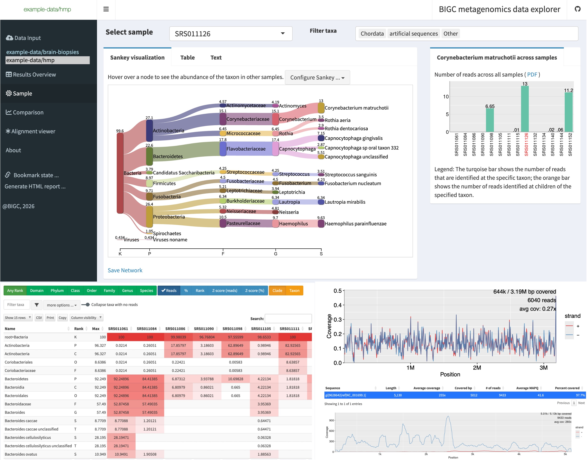

BigcMetaExplorer is a interactive browser application for analyzing and visualization metagenomics classification results from classifiers such as Kraken, KrakenUniq, Kraken 2, Centrifuge and MetaPhlAn. BigcMetaExplorer also provides an alignment viewer for validation of matches to a particular genome.

You can try out BigcMetaExplorer at <https://bigc.shinyapps.io/shinyapp/>.

## Installation and deployment

BigcMetaExplorer is a R package, and thus requires R to run. Look [here](http://a-little-book-of-r-for-bioinformatics.readthedocs.io/en/latest/src/installr.html) for how to install R. On Windows, you probably need to install [Rtools](cran.r-project.org/bin/windows/Rtools/). On Ubuntu, install `r-base-dev`. Once you started R, the following commands will install the package:

``` r
if (!require(remotes)) { install.packages("remotes") }
remotes::install_github("geekep/BigcMetaExplorer")
```

To run BigcMetaExplorer from R, type

``` r
BigcMetaExplorer::runApp(port=5000)
```

BigcMetaExplorer will then be available at <http://127.0.0.1:5000> in the web browser of you choice.

Alternatively, you can install and test BigcMetaExplorer with the following command:

``` r
shiny::runGitHub("geekep/BigcMetaExplorer", subdir = "inst/shinyapp")
```

# Installing Rsamtools

The alignment viewer uses [Rsamtools](https://bioconductor.org/packages/release/bioc/html/Rsamtools.html). To install this package from Bioconductor, use the following commands

``` r
if (!requireNamespace("BiocManager", quietly = TRUE)) { install.packages("BiocManager") }
BiocManager::install("Rsamtools")
```

## Installing to Shinyapps.io

In order to install to Shinyapps.io, because of the Bioconductor repo dependencies, you need to first set the options in R.

``` r
setRepositories()
rsconnect::deployApp("BigcMetaExplorer/inst/shinyapp/")
```

## Docker image

As an alternative to installing BigcMetaExplorer in R, a Docker image is available at [geekep/BigcMetaExplorer](https://hub.docker.com/r/florianbw/BigcMetaExplorer/). When you run this docker image, BigcMetaExplorer will start automatically on port 80, which you need to make available to the hosting machine. On the shell, you can pull the image and remap the Docker port to port 5000 with the following commands:

``` sh
docker pull 'geekep/BigcMetaExplorer'
docker run --rm -p 5000:80 geekep/BigcMetaExplorer
```

## Screenshots



## Supported formats

BigcMetaExplorer natively supports the Kraken and MetaPhlAn-style report formats. In extension, you can use Centrifuge results by running `centrifuge-kreport` on Centrifuge output files, and Kaiju results by running `kraken-report` on Kaiju output files.

**Error: Maximum upload size exceeded** The maximum upload size is defined by the option `shiny.maxRequestSize`. To increase it to 500 MB, for example, run the following instead of `BigcMetaExplorer::runApp()`:

```         
BigcMetaExplorer::runApp(port=5000, maxUploadSize = (500*1024^2))
```

If your BAM file contains the unaligned reads, you can decrease the file size before uploading by getting rid of non-aligned reads using samtools view -F4.

# Acknowledgments

We'd like to thank the creators, contributors and maintainers of several packages without whom BigcMetaExplorer wouldn't exist:

-   Winston Chang, Hadley Wickham, Joe Cheng, JJ Allaire and all other developers at [Rstudio](https://shiny.rstudio.com/) and outside who contribute to the amazing set of packages behind shiny and the tidyverse (shiny, shinydashboard, DT, dplyr, plyr, htmltools, htmlwidgets, rmarkdown, knitr, ggplot2, rappdirs)
-   Mike Bostock and all developers behind the amazong [D3](https://d3js.org/) visualization library
-   Dean Atali for the [shinyjs](https://github.com/daattali/shinyjs) R package
-   dreamR developers for the [shinyWidgets](https://github.com/dreamRs/shinyWidgets) R package
-   Jonathan Owen for [rhandsontable](https://github.com/jrowen/rhandsontable) widget, based on the [handsontable](https://handsontable.com) javascript library
-   M. Morgan and the other developers behind [Rsamtools](https://bioconductor.org/packages/release/bioc/html/Rsamtools.html), as well as Heng Li and the other developers behind [samtools](https://github.com/samtools/samtools)
-   Christopher Garund and the other developers behind [networkD3](https://christophergandrud.github.io/networkD3/), on which sankeyD3 is based
-   The developers of [jstree](https://www.jstree.com/), on which shinyFileTree is based
